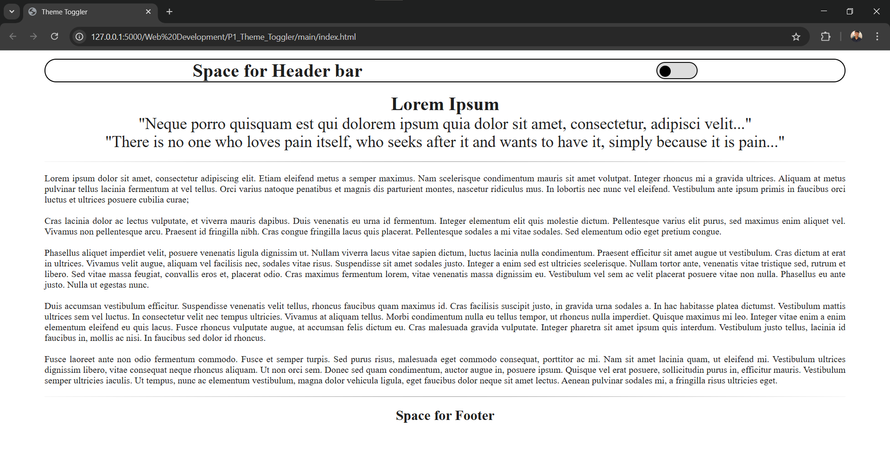
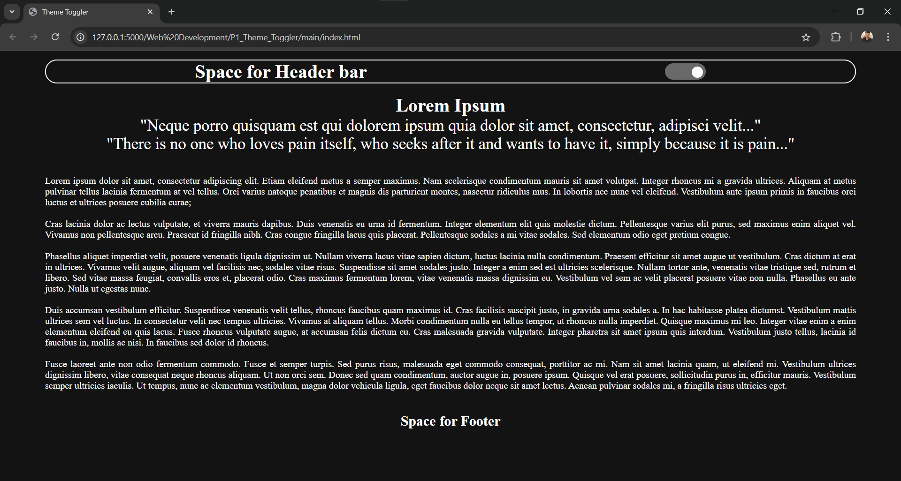

# 🌗 Theme Toggler Web App

This is a simple yet interactive **Theme Toggler** project built using **HTML**, **CSS**, and **JavaScript**. It allows users to switch between light and dark modes, and remembers their preference using `localStorage`.

> 💡 Built as part of my **Web Development journey**  by **Rohit Negi Sir**.

---

## 🔥 Features

- 🌓 Toggle between **light and dark themes**.
- 💾 Saves theme preference in the browser using **localStorage**.
- 🎯 Smooth transition effects and responsive layout.
- ✅ Defaults to user's **system theme** if no preference is set.
- 🔘 Custom toggle switch animation for theme changing.

---

## 📸 Preview

- **Light Theme View**



- **Dark Theme View**



---

## 🛠️ Tech Stack

- **HTML5**
- **CSS3**
- **Vanilla JavaScript**

---

## 🚀 How to Use

1. Clone the repo:
   ```bash
   git clone https://github.com/your-username/Projects.git
